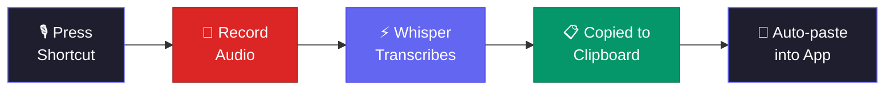
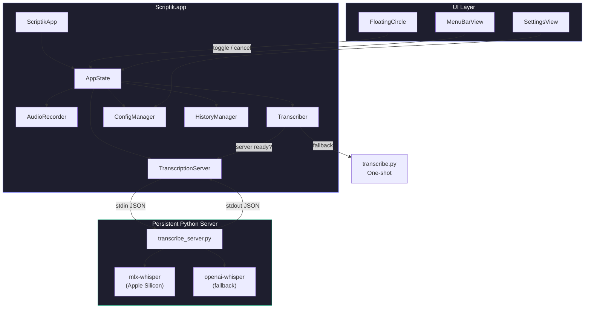

# Scriptik

A global keyboard shortcut for macOS that records audio and transcribes it using [OpenAI Whisper](https://github.com/openai/whisper) — all running locally on your machine.

Press once to **start recording**. Press again to **stop, transcribe, and copy to clipboard**.


## How it works





**Features:**
- **Menu bar app** — lives in the menu bar with a floating circle indicator
- **Global hotkey** — toggle recording from any app
- **100% local** — no audio leaves your machine
- **Persistent Whisper server** — model stays loaded in memory, eliminating cold start
- **Floating circle** — shows live waveform while recording, progress ring while transcribing
- **mlx-whisper acceleration** — 5-10x faster on Apple Silicon
- Auto-detects language (English, Hebrew, and more)
- Auto-paste transcription into the previously active app
- Timestamps and pause detection in output
- Filters Whisper hallucinations automatically
- Configurable model, language, prompts, and thresholds
- Transcription history with search

## Prerequisites

- **macOS 14+** (Sonoma)
- **Swift 5.10+** (via Homebrew: `brew install swift`)
- **Python 3** (for Whisper)
- **ffmpeg** (`brew install ffmpeg`)

## Install

### Native App (recommended)

```bash
git clone https://github.com/Leon-Rud/scriptik.git
cd scriptik

# Set up Whisper (Python venv + model download)
./scriptik-cli --setup

# Build and install the native app
make install
```

Then launch **Scriptik** from Applications or Spotlight.

### CLI-only (alternative)

If you prefer a command-line tool without the native app:

```bash
git clone https://github.com/Leon-Rud/scriptik.git
cd scriptik
./install.sh
```

## Usage

### Native App

1. Launch **Scriptik** from /Applications or Spotlight
2. A floating circle appears on screen — click it or press your global shortcut to start recording
3. The circle shows a live waveform and elapsed time while recording
4. Click the circle again or press the shortcut to stop
5. A progress ring animates while Whisper transcribes locally
6. Text is automatically copied to clipboard (and auto-pasted into the previously active app)

**Right-click the circle** for Settings, History, and Quit.

**Menu bar** — also accessible from the menu bar icon.

> **Auto-paste setup:** For auto-paste to work, grant Accessibility permission at
> **System Settings > Privacy & Security > Accessibility** and enable Scriptik.

### CLI

```bash
scriptik-cli            # Toggle recording on/off
scriptik-cli --setup    # Install Whisper and create config
scriptik-cli --status   # Check if currently recording
scriptik-cli --log      # View recent log entries
scriptik-cli --help     # Show help
```

### Output format

```
  [0.0s --> 2.3s] So the main challenge here was the database schema
  [2.3s --> 4.1s] [pause 1.8s]
  [4.1s --> 8.7s] We decided to use a normalized approach with foreign keys
```

## Configuration

Edit `~/.config/scriptik/config` (shared between app and CLI):

```bash
# Whisper model: tiny, base, small, medium, large
WHISPER_MODEL="medium"

# Seconds of silence before marking a [pause]
PAUSE_THRESHOLD="1.5"

# Hint words to improve transcription accuracy
INITIAL_PROMPT="Docker, FastAPI, PostgreSQL, React"

# Auto-paste transcription into active app
AUTO_PASTE="true"

# Language: auto, en, he
LANGUAGE="auto"
```

### Model comparison

Speed estimates for a ~10s recording on Apple Silicon (with persistent server — no cold start):

| Model    | Size   | Speed    | Accuracy |
|----------|--------|----------|----------|
| `tiny`   | 75MB   | ~0.5s    | Basic    |
| `base`   | 140MB  | ~1s      | Good     |
| `small`  | 500MB  | ~2s      | Great    |
| `medium` | 1.5GB  | ~4s      | Excellent|
| `large`  | 3GB    | ~8s      | Best     |

## Building from source

```bash
cd Scriptik
swift build          # Debug build
swift build -c release  # Release build
bash scripts/bundle.sh  # Create .app bundle
```

The app bundle is output to `Scriptik/build/Scriptik.app`.

## Uninstall

```bash
./uninstall.sh
```

Removes the CLI script, Quick Action, config, and Whisper environment.

To remove the native app: delete `Scriptik.app` from Applications.

## Troubleshooting

### Microphone permission
The app needs microphone access. Go to **System Settings > Privacy & Security > Microphone** and enable Scriptik.

### Auto-paste not working
Auto-paste requires Accessibility permission. Go to **System Settings > Privacy & Security > Accessibility** and enable Scriptik.

### Transcription is empty or wrong
- Try a larger model in Settings (or edit `WHISPER_MODEL="medium"` in config)
- Add context words to the initial prompt for domain-specific terms
- Check logs: `scriptik-cli --log`

### Global shortcut not working
Open the app's Settings and set your preferred key combination in the Shortcut tab.

## License

MIT
