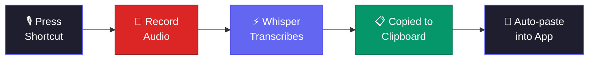

<p align="center">
  <h1 align="center">Scriptik</h1>
</p>

<p align="center">
  <b>Open-source macOS voice-to-text app — record, transcribe locally with Whisper, and paste anywhere.</b>
</p>

<p align="center">
  
  
  
  
</p>

---

Press once to **start recording**. Press again to **stop, transcribe, and paste** — all running locally on your machine.

<!-- TODO: Add a demo GIF here showing the recording flow -->

## Features

- **Menu bar app** — lives in the menu bar with a floating circle indicator
- **Global hotkey** — toggle recording from any app
- **100% local** — no audio leaves your machine, ever
- **Persistent Whisper server** — model stays loaded in memory, no cold start
- **Live waveform** — floating circle shows waveform while recording, progress ring while transcribing
- **mlx-whisper acceleration** — 5-10x faster on Apple Silicon
- **Auto-paste** — transcription is copied to clipboard and pasted into the previously active app
- **Multi-language** — auto-detects English, Hebrew, and more
- **Transcription history** — searchable history of past transcriptions
- **Configurable** — model, language, prompts, pause thresholds, and more

## How It Works



## Getting Started

### Requirements

- **macOS 14+** (Sonoma)
- **Python 3** (for Whisper)
- **ffmpeg** (`brew install ffmpeg`)

### Install

```bash
git clone https://github.com/Leon-Rud/scriptik.git
cd scriptik

# Set up Whisper (Python venv + model download)
./scriptik-cli --setup

# Build and install the native app
make install
```

Then launch **Scriptik** from Applications or Spotlight.

> **Permissions:** Grant Microphone and Accessibility access at **System Settings > Privacy & Security** for recording and auto-paste to work.

### CLI-only (alternative)

If you prefer a command-line tool without the native app:

```bash
git clone https://github.com/Leon-Rud/scriptik.git
cd scriptik
./install.sh
```

## Usage

1. Launch **Scriptik** from /Applications or Spotlight
2. A floating circle appears — click it or press your global shortcut to start recording
3. The circle shows a live waveform and elapsed time while recording
4. Click again or press the shortcut to stop
5. Text is automatically copied to clipboard and pasted into the active app

**Right-click the circle** for Settings, History, and Quit.

### Keyboard Shortcuts

| Shortcut | Action |
|----------|--------|
| Custom global hotkey | Toggle recording on/off |
| Right-click circle | Open context menu |

### CLI Commands

```bash
scriptik-cli            # Toggle recording on/off
scriptik-cli --setup    # Install Whisper and create config
scriptik-cli --status   # Check if currently recording
scriptik-cli --log      # View recent log entries
scriptik-cli --help     # Show help
```

## Configuration

Edit `~/.config/scriptik/config` (shared between app and CLI):

```bash
WHISPER_MODEL="medium"       # tiny, base, small, medium, large
PAUSE_THRESHOLD="1.5"        # Seconds of silence before [pause]
INITIAL_PROMPT="Docker, FastAPI, PostgreSQL, React"  # Hint words
AUTO_PASTE="true"            # Auto-paste into active app
LANGUAGE="auto"              # auto, en, he, ...
```

### Model Comparison

Speed estimates for ~10s recording on Apple Silicon (persistent server, no cold start):

| Model | Size | Speed | Accuracy |
|-------|------|-------|----------|
| `tiny` | 75MB | ~0.5s | Basic |
| `base` | 140MB | ~1s | Good |
| `small` | 500MB | ~2s | Great |
| `medium` | 1.5GB | ~4s | Excellent |
| `large` | 3GB | ~8s | Best |

## Building from Source

```bash
cd Scriptik
swift build              # Debug build
swift build -c release   # Release build
bash scripts/bundle.sh   # Create .app bundle
```

The app bundle is output to `Scriptik/build/Scriptik.app`.

## Troubleshooting

| Problem | Solution |
|---------|----------|
| Microphone not working | **System Settings > Privacy & Security > Microphone** — enable Scriptik |
| Auto-paste not working | **System Settings > Privacy & Security > Accessibility** — enable Scriptik |
| Empty/wrong transcription | Try a larger model in Settings, add context words to initial prompt |
| Global shortcut not working | Open Settings and re-set your preferred key combination |

## Contributing

Contributions are welcome! Whether it's bug fixes, new features, or documentation improvements — all help is appreciated.

1. Fork the repository
2. Create your feature branch (`git checkout -b feature/amazing-feature`)
3. Commit your changes (`git commit -m 'Add amazing feature'`)
4. Push to the branch (`git push origin feature/amazing-feature`)
5. Open a Pull Request

AI-assisted contributions are welcome, as long as they are well-tested and reviewed.

Please be respectful and constructive in all interactions.

## Support

If you find Scriptik useful, consider supporting its development:

<p align="center">
  <a href="https://buymeacoffee.com/leonrud">
    
  </a>
  &nbsp;&nbsp;
  <a href="https://github.com/sponsors/Leon-Rud">
    
  </a>
</p>

Starring the repo is also a great way to show support! ⭐

## Uninstall

```bash
./uninstall.sh
```

Removes the CLI script, Quick Action, config, and Whisper environment. To remove the native app, delete `Scriptik.app` from Applications.

## License

[MIT](LICENSE)

## Author

**Leon Rudenko** — [@Leon-Rud](https://github.com/Leon-Rud)
