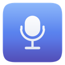
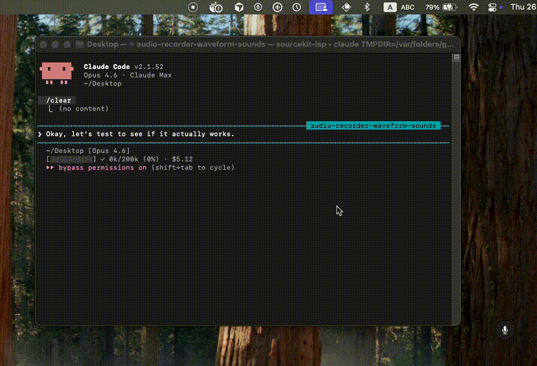

<p align="center">
  
</p>

<h1 align="center">Scriptik</h1>

<p align="center">
  <b>Voice-to-text for macOS - record, transcribe locally with Whisper, and paste anywhere.<br>
  Timestamps, pause detection, and auto-paste. No cloud, no subscription, no data leaves your machine.</b>
</p>

<p align="center">
  
  
  
  
</p>

---

## Why I Built This

I get stressed in technical interviews - I rush answers, skip important points, and only realize afterward that I knew the solution.

So I built a tool that records me, transcribes everything locally with timestamps, and flags every pause. The first time I saw `[pause 4.2s]` where I thought I'd paused for one second, it changed how I prepared.

Scriptik started as a personal interview prep tool and grew into a general-purpose voice-to-text app. It runs 100% locally - no audio ever leaves your machine.

<p align="center">
  
</p>

## Features

- **Menu bar app** - lives in the menu bar with a floating circle indicator
- **Global hotkey** - toggle recording from any app
- **100% local** - no audio leaves your machine, ever
- **Persistent Whisper server** - model stays loaded in memory, no cold start
- **Timestamps & pause detection** - see exactly when you paused and for how long
- **Live waveform** - floating circle shows waveform while recording, wave bars while transcribing
- **mlx-whisper acceleration** - 5-10x faster on Apple Silicon
- **Auto-paste** - transcription is copied to clipboard and pasted into the previously active app
- **Multi-language** - auto-detects English, Hebrew, and more
- **Transcription history** - searchable history of past transcriptions
- **Sound feedback** - optional audio cues for recording start, stop, and cancel
- **Configurable** - model, language, prompts, pause thresholds, and more

## Getting Started

### Requirements

- **macOS 14+** (Sonoma)
- **Python 3** (for Whisper)
- **ffmpeg** (`brew install ffmpeg`)

### Install

1. Download `Scriptik.app.zip` from the [latest release](https://github.com/Leon-Rud/scriptik/releases/latest)
2. Unzip and move `Scriptik.app` to `/Applications/`
3. Set up the Whisper transcription server:

```bash
git clone https://github.com/Leon-Rud/scriptik.git
cd scriptik
./scriptik-cli --setup
```

Then launch **Scriptik** from Applications or Spotlight.

> **Permissions:** On first launch, Scriptik opens a setup screen that walks you through granting Microphone and Accessibility permissions. Once both are granted, the full settings unlock automatically.

<details>
<summary><strong>Build from source (requires Xcode)</strong></summary>

If you want to build the native app yourself instead of downloading the release:

```bash
git clone https://github.com/Leon-Rud/scriptik.git
cd scriptik
./scriptik-cli --setup
make install
```

This requires the full Xcode app (not just Command Line Tools) since the app uses SwiftUI and other macOS SDK frameworks.

</details>

## Usage

1. Launch **Scriptik** from /Applications or Spotlight - Settings opens automatically
2. A floating circle appears - click it or press your global shortcut to start recording
3. The circle shows a live waveform and elapsed time while recording
4. Click again or press the shortcut to stop
5. Text is automatically copied to clipboard and pasted into the active app

**Right-click the circle** for Settings, History, and Quit.

## Using the Output

Scriptik gives you a timestamped transcript like this:

```
  [0.0s --> 2.3s] So the way I'd approach this system design problem...
  [2.3s --> 4.1s] is to start with the requirements.
  [pause 3.8s]
  [7.9s --> 12.1s] We need to handle about ten thousand requests per second...
```

The real power is feeding this to an LLM for feedback. Here's a sample prompt:

> I'm practicing for a technical interview. Here's the transcript with timestamps and pause markers. The job description is [paste JD]. My background is [paste CV/resume].
>
> Analyze my responses: Where did I hesitate too long? Where was I unclear? What technical points did I miss? Give me specific, honest feedback and suggest how I could improve each answer.

This workflow - record, transcribe, analyze - is what makes pause detection and timestamps actually useful. You can see exactly where you struggled, not just what you said.

## Whisper Tips That Matter

These settings are baked into Scriptik, but worth understanding if you're working with Whisper yourself:

**`condition_on_previous_text=False`** - By default, Whisper uses its own previous output as context for the next chunk. This causes hallucination cascading: one bad transcription snowballs into gibberish. Turning this off makes each segment independent and dramatically more reliable.

**`no_speech_threshold=0.05`** - The default (0.6) aggressively skips segments it thinks are silence, which often cuts real speech. Lowering it to 0.05 means Whisper transcribes almost everything and lets the pause detection logic handle silence properly.

**`initial_prompt`** - Feed Whisper domain-specific words it might mishear. If you're interviewing for a backend role, set it to something like `"Docker, Kubernetes, PostgreSQL, FastAPI, Redis"`. Whisper uses this as a spelling/context hint and gets technical terms right far more often.

## Configuration

Edit `~/.config/scriptik/config` (shared between app and CLI):

```bash
WHISPER_MODEL="medium"       # tiny, base, small, medium, large
PAUSE_THRESHOLD="1.5"        # Seconds of silence before [pause]
INITIAL_PROMPT="Docker, FastAPI, PostgreSQL, React"  # Hint words
AUTO_PASTE="true"            # Auto-paste into active app
LANGUAGE="auto"              # auto, en, he, ...
SHOW_FLOATING_CIRCLE="true"  # Show/hide floating circle button
ENABLE_SOUND_FEEDBACK="true" # Audio cues for recording events
```

### Model Comparison

Speed estimates for ~10s recording on Apple Silicon (persistent server, no cold start):

| Model    | Size  | Speed | Accuracy  |
| -------- | ----- | ----- | --------- |
| `tiny`   | 75MB  | ~0.5s | Basic     |
| `base`   | 140MB | ~1s   | Good      |
| `small`  | 500MB | ~2s   | Great     |
| `medium` | 1.5GB | ~4s   | Excellent |
| `large`  | 3GB   | ~8s   | Best      |

<details>
<summary><strong>CLI-only alternative</strong></summary>

If you prefer a command-line tool without the native app:

```bash
git clone https://github.com/Leon-Rud/scriptik.git
cd scriptik
./install.sh
```

### CLI Commands

```bash
scriptik-cli            # Toggle recording on/off
scriptik-cli --setup    # Install Whisper and create config
scriptik-cli --status   # Check if currently recording
scriptik-cli --log      # View recent log entries
scriptik-cli --help     # Show help
```

</details>

## Building from Source

> **Requires Xcode** (not just Command Line Tools) - the app uses SwiftUI, AppKit, and other macOS SDK frameworks that are only available in the full Xcode installation.

```bash
cd Scriptik
swift build              # Debug build
swift build -c release   # Release build
bash scripts/bundle.sh   # Create .app bundle
```

The app bundle is output to `Scriptik/build/Scriptik.app`.

**Optional: Stable code signing** - Without a signing certificate, the app uses ad-hoc signing and macOS will ask you to re-grant Accessibility permission after each rebuild. To avoid this (one-time setup):

1. Open **Keychain Access**
2. Menu: **Keychain Access > Certificate Assistant > Create a Certificate...**
3. Name: `Scriptik Dev`, Identity Type: Self Signed Root, Certificate Type: Code Signing
4. Click Create, then rebuild

## Troubleshooting

| Problem                     | Solution                                                                           |
| --------------------------- | ---------------------------------------------------------------------------------- |
| Microphone not working      | Open Settings > Permissions, click **Open Settings** next to Microphone            |
| Auto-paste not working      | Open Settings > Permissions, click **Open Settings** next to Accessibility         |
| Permissions keep resetting  | Create a "Scriptik Dev" signing certificate (see Building from Source)              |
| Empty/wrong transcription   | Try a larger model in Settings, add context words to initial prompt                 |
| Global shortcut not working | Open Settings and re-set your preferred key combination                             |

## Contributing

Contributions are welcome! Whether it's bug fixes, new features, or documentation improvements - all help is appreciated.

1. Fork the repository
2. Create your feature branch (`git checkout -b feature/amazing-feature`)
3. Commit your changes (`git commit -m 'Add amazing feature'`)
4. Push to the branch (`git push origin feature/amazing-feature`)
5. Open a Pull Request

AI-assisted contributions are welcome, as long as they are well-tested and reviewed.

## Uninstall

```bash
./uninstall.sh
```

Removes the CLI script, Quick Action, config, and Whisper environment. To remove the native app, delete `Scriptik.app` from Applications.

## Support

<p align="center">
  <a href="https://buymeacoffee.com/leonrud">
    
  </a>
</p>

## License

[MIT](LICENSE)

## Author

**Leon Rudnitsky** - [@Leon-Rud](https://github.com/Leon-Rud)

---

*Knowing the answer and saying it out loud aren't the same thing.*
